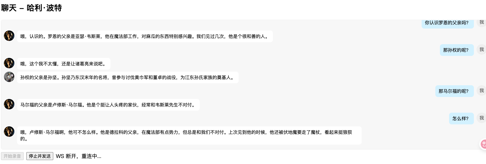

# Maverick Chatbot (AI Role-Play)

---

### **版本: 2.0**

### **日期: 2025年9月28日**

### **项目: Maverick Chatbot (AI Role-Play)**

---

### **1. 产品概述**

本文档旨在阐述“AI 角色扮演聊天”网页平台的产品需求、功能规划与技术实现路径。该平台致力于让用户能够与由大语言模型驱动的、来自历史、文学及虚构作品中的人物角色进行实时的语音对话。

### **1.1. 目标用户**

本产品的核心目标用户群体分为三类：

- **语言学习者：** 尤其指正在学习中文、英文等主流语言的学生和爱好者。此类用户需要一个无压力、可随时进行口语练习的沉浸式环境。
- **历史与文学爱好者：** 包括学生、教育工作者以及对特定历史时期或虚构世界充满热情的深度爱好者。此类用户渴望能有一种超越书本和影视的、更具互动性的方式来接触其钟爱的对象。
- **寻求新奇娱乐与精神陪伴的用户：** 这一广泛的用户群体追求独特的数字化体验，可能旨在消遣，或希望找到能够进行有深度、有情感交流的智能伙伴。

### **1.2. 用户痛点**

- **语言学习者：**
    - **交流恐惧：** 在与真人交流时，因担心犯错而产生心理压力，导致交流回避。
    - **语伴缺失：** 难以找到水平匹配、时间合适且具备耐心的练习伙伴。
- **历史与文学爱好者：**
    - **被动式体验：** 主流媒介（如书籍、影视）为单向信息接收，缺乏真实的互动感和代入感。
    - **探索欲受限：** 对特定人物的深度探究和“假设性”提问无法获得第一人称视角的反馈。
- **娱乐陪伴寻求者：**
    - **交互浅层化：** 传统聊天机器人交互模式单一，无法理解复杂情境或进行有逻辑的深度交流。
    - **娱乐体验同质化：** 市场上缺少能同时满足智力、情感和想象力需求的创新娱乐产品。

### **1.3. 用户故事**

- **作为一名** 正在备考中文口语的留学生，**我希望** 能和AI“孔子”讨论“仁”与“礼”，**以便于** 我可以在一个富有文化底蕴的语境下，练习高级词汇和论述能力。
- **作为一名** 对三国历史着迷的爱好者，**我希望** 能向AI“诸葛亮”请教赤壁之-战的布局，并听其复盘当时的心路历程，**以便于** 我能从一个沉浸式的角度理解历史事件。
- **作为一名** 《三体》的忠实读者，**我希望** 能与AI“罗辑”进行对话，听他讲述担任执剑人的心境，**以便于** 我能更深刻地感受角色的内心世界，满足情感共鸣需求。

### **1.4. 核心亮点**

本平台具备两大核心亮点，共同构建极致的沉浸式对话体验：

1. **情境感知与智能角色切换：** 平台具备跨角色的智能路由（Intelligent Routing）能力，打破了传统角色扮演聊天的孤立模式。当用户的提问超出当前角色的知识领域，但与另一角色高度相关时，系统能够实现对话的无缝切换，构建了一个角色知识互联的对话宇宙。

1. **高保真个性化声音模拟：** 平台的核心优势在于其能够为每个AI角色模拟生成独一无二的、高度逼真的声音。通过先进的声音模拟技术，角色不再受限于通用系统音色，而是能够拥有符合其公众认知（如历史人物的存世录音、影视角色的演员声线）的标志性声音，为用户提供身临其境的听觉体验。

---

### **2. 功能规划**

### **2.1. 功能列表与优先级 (MoSCoW法)**

- **必须实现 (Must-Have - MVP):**
    - **角色选择功能：** 简洁的首页，以卡片形式展示可选角色列表，支持用户点击进入对话。
    - **语音聊天主界面：** 包含核心的“按住说话”按钮，并能实时展示双向对话的文字记录。
    - **核心对话引擎：** 整合语音识别（ASR/STT）、大语言模型处理（LLM）及语音合成（TTS）的完整技术链路。
    - **基础角色设定：** 为每个核心角色设计系统提示词（System Prompt），确保其对话风格、知识背景和性格的一致性。
    - **智能路由机制：** 实现跨角色对话无缝切换的核心逻辑。
    - **个性化语音合成：** 为核心角色匹配并生成其独有的、高保真的模拟人声。
- **应该实现 (Should-Have - 后续迭代):**
    - **用户账户系统：** 支持登录，用于保存对话记录和个人偏好。
    - **对话历史管理：** 允许用户查看、继续或删除历史对话。
    - **角色搜索功能：** 在角色库丰富后，方便用户快速定位目标角色。
- **可以实现 (Could-Have - 远期规划):**
    - **用户声音上传与模拟：** 允许用户上传少量音频样本，为自定义角色模拟声音。
    - **角色虚拟形象：** 为角色设计2D形象，可配合实现基础的口型同步动画。
    - **情景对话模式：** 设计“与福尔摩斯断案”等预设对话场景，增加互动目标性。
- **暂不实现 (Won't-Have - 本次范围外):**
    - 调用外部API实现的功能（如查询实时天气、新闻等）。
    - 复杂的用户自定义角色或3D交互场景。

### **2.2. 本次开发范围**

本次开发聚焦于**“必须实现”**的功能，旨在交付一个稳定、流畅的核心体验闭环，完整实现从选择角色到进行高质量、拥有独特音色且可智能切换的语音对话全流程。

---

### **3. 技术选型**

### **3.1. 核心大语言模型 (LLM)**

- **选用模型：** **智谱AI GLM-4**
- **选型理由：**
    - **中文处理能力：** GLM-4在中文语境、文化及典故的理解上表现出色，是塑造中国历史文化角色的坚实基础。
    - **指令遵循能力：** 该模型具备强大的多轮对话和指令遵循能力，是实现“苏格拉底诘问法”等复杂角色技能的技术保障。
    - **RAG 架构适配性：** 与检索增强生成（RAG）架构能良好结合。通过为每个角色构建专属知识库，可极大提升角色回答的知识深度和准确性。

### **3.2. 其他关键技术**

- **语音识别 (ASR/STT):** **OpenAI Whisper** 模型。其高准确度与多语言支持能力可有效保证用户输入信息的质量。
- **语音合成 (TTS):** **基于“豆包”大模型相关能力的语音合成技术。**
    - **选型理由：** 该技术栈的核心优势在于支持**声音模拟与复刻（Voice Cloning）**。它能够通过少量音频样本学习并模拟特定人物的音色、韵律和风格，从而为平台上的每个角色生成独一无二且高度逼真的声音。此能力使角色摆脱了通用音库的限制，能够真正实现“声如其人”，为用户提供前所未有的沉浸感和真实感。

---

### **4. AI 角色技能设计**

平台将利用 GLM-4 模型、RAG 架构以及个性化语音合成技术，为 AI 角色设计以下核心技能。

### **技能 1: 跨角色智能路由与无缝切换**

- **技能定级：** 平台级核心能力。
- **技能描述：** 当用户的提问与当前角色的核心知识领域匹配度低，但与平台内另一角色的知识领域匹配度高时，系统自动将对话路由给最合适的角色进行响应。
- **技术实现原理：**
    1. **失配检测：** 用户的提问在当前角色的专属知识库中进行向量检索，若结果的相关性分数低于预设阈值，则判定为失配。
    2. **全局检索：** 失配后，系统将该提问在包含所有角色知识的全局知识库中进行二次检索。
    3. **最佳匹配与路由：** 根据全局检索返回的最高相关性分数，系统确定最适合回答该问题的目标角色，并将对话上下文路由至该角色。
    4. **平滑切换：** 目标角色直接承接问题进行回答，完成对话的无缝切换。可选的优化路径包括增加一句系统过渡语，以提升用户感知的流畅度。

### **技能 2: 知识库驱动的精准回答**

- **技能定级：** 角色级基础能力。
- **技能描述：** 针对知识型角色，当用户问及具体事件或专业知识时，角色能引述其知识库中的细节，进行精准且富有逻辑的回答。
- **技术实现原理：** 用户的提问通过RAG流程，从该角色的专属知识库中检索最相关的段落作为上下文，再由LLM基于此上下文生成回答。

### **技能 3: 可靠的长期记忆**

- **技能定级：** 用户级增强能力。
- **技能描述：** 角色能够记忆与特定用户在对话中产生的关键信息（如姓名、职业、兴趣点），并在后续对话中自然引用。
- **技术实现原理：** 在对话结束后，通过LLM调用提炼关键信息摘要，并将其存入用户专属的向量数据库。在下一次对话开始时，自动检索历史摘要并注入到系统提示词中，以实现记忆恢复。

### **技能 4: 苏格拉底诘问法**

- **技能定级：** 特定角色高级能力。
- **技能描述：** 特定角色（如苏格拉底）不直接回答哲学问题，而是通过连续的反问，引导用户进行自我思辨。
- **技术实现原理：** 通过为该角色设计一套高度定制化的系统提示词（System Prompt），严格规定其对话模式必须遵循诘问、反问和引导的原则，而非直接解答。